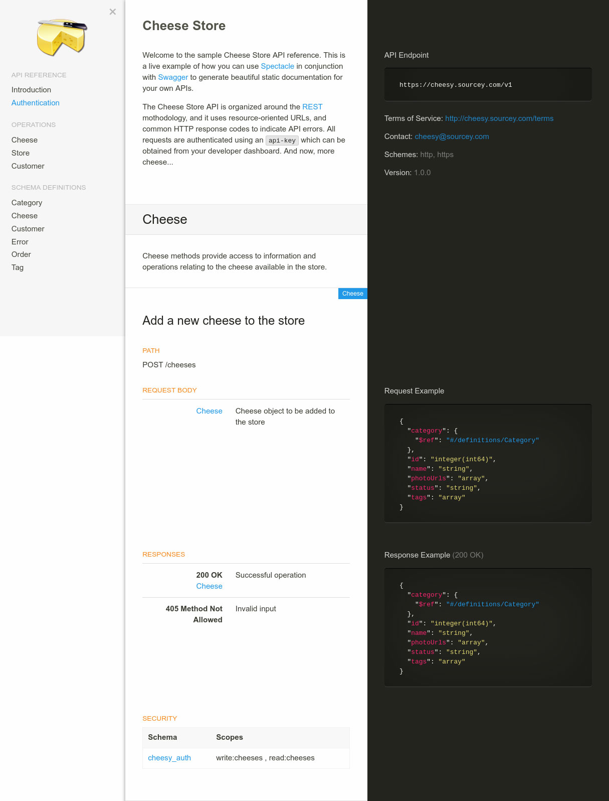

# Spectacle

> The gentleman at REST

[](https://circleci.com/gh/sourcey/spectacle)

Spectacle generates beautiful static HTML5 documentation from [OpenAPI](https://openapis.org)/[Swagger](http://swagger.io) 2.0 API specifications.

The goal of Spectacle is help you "save time and look good" by providing an extensible platform for auto generating your REST API docs. The default layout is a three column single page, similar to those
employed by [Stripe](https://stripe.com/docs/api) and [Intercom](https://developers.intercom.com/reference).

See a demo of Spectacle in action here: [http://cheesestore.github.io](http://cheesestore.github.io)

---



---

## Features

* **OpenAPI/Swagger 2.0 support**: Support for the latest OpenAPI/Swagger specification.
* **Highly configurable**: Easily configurable Handlebars templates and SCSS styles so you can add your own design and flavour without going bald. See [Custom Builds](#custom-builds)
* **Markdown support**: Render markdown written in any of your API descriptions.
* **Remote file references**: Support for swagger specs split across multiple files.
* **Clean responsive design**: Responsive HTML5 and CSS3 layout built with [Foundation 6](http://foundation.zurb.com/sites.html) that looks great on all devices and screen sizes.
* **Embed into your existing website**: An embedded option so that generate partial docs without a HTML `<body>` for convenient integration into your existing website.
* **Live preview developer mode**: Development mode that starts a local HTTP server with a file watcher and live reload so you can preview live changes in your browser as you update your spec.

## Usage

Simply install Spectacle from `npm` like so:

```bash
npm install -g spectacle-docs
```

Next pass your `swagger.json` document use the CLI to generate your documentation.

```bash
spectacle -d your_swagger_api.json

# Or use the cheese.json example to test it out
# spectacle -d -l test/fixtures/cheese.png test/fixtures/cheese.json
```

Your generated documentation will be located in the `public` directory by default. You can either copy the generated HTML to your web server, or view your docs by pointing your browser to [http://localhost:4400/](http://localhost:4400/).

### Docker

[Docker](https://hub.docker.com/r/sourcey/spectacle/) images are included that allow Spectacle to be run from the inside. It's useful, for instance, in a Gitlab CI pipeline. Thanks @alexeiaguiar.

How to use it: `docker run -it sourcey/spectacle /bin/sh`

## Configuration Options

The basic CLI options are detailed below:

```bash
$ spectacle -h

  Usage: spectacle [options] <specfile>

  Options:

    -h, --help                   output usage information
    -V, --version                output the version number
    -C, --disable-css            omit CSS generation (default: false)
    -J, --disable-js             omit JavaScript generation (default: false)
    -e, --embeddable             omit the HTML <body/> and generate the documentation content only (default: false)
    -d, --development-mode       start HTTP server with the file watcher (default: false)
    -D, --development-mode-live  start HTTP server with the file watcher and live reload (default: false)
    -s, --start-server           start the HTTP server without any development features
    -p, --port <port>            the port number for the HTTP server to listen on (default: 4400)
    -P, --port-live <port>       the port number for the live reload to listen on (default: 4401)
    -t, --target-dir <dir>       the target build directory (default: public)
    -f, --target-file <file>     the target build HTML file (default: index.html)
    -a, --app-dir <dir>          the application source directory (default: app)
    -l, --logo-file <file>       specify a custom logo file (default: null)
    -c, --config-file <file>     specify a custom configuration file (default: app/lib/config.js)
```

Most options are self explanatory, but the following options warrant some further explanation:

* **--development-mode** `-d`: This option starts a development server with a file watcher, and will automatically regenerate your docs when any of your spec or app files change.

* **--development-mode-live** `-D`: This option starts a development server with a file watcher and live reload, and will automatically regenerate your docs when any of your spec or app files change.

* **--start-server** `-s`: This option starts a production server without any development options enabled that serves the contents of your `--target-dir`.

* **--embeddable** `-e`: This option lets you build a minimal version of the documentation without the HTML `<body>` tags, so you can embed Spectacle into your own website template. More info on [custom builds](#custom-builds) here.

* **--app-dir** `-a`: This option overrides the default directory which contains all the Handlebars templates, SCSS, and JavaScript source files. This option is useful for development because you can copy the contents of `app` to a remote location or a separate repo for custom builds.

* **--target-dir** `-t`: This option specifies where the generated documentation HTML files will be output.

## Custom Builds

The best option for building your own custom functionality into Spectacle is to [fork Spectacle on GitHub](https://help.github.com/articles/fork-a-repo/), and make your own modifications in source. This way you can keep up to date by merging changes from the `master` branch, and your can also contribute your updates back to `master` by creating a [Pull Request](https://help.github.com/articles/creating-a-pull-request/) if you think they improve Spectacle somehow.

To fork Spectacle go to `https://github.com/sourcey/spectacle`, and press the 'Fork' button. Now you can `git clone git@github.com:<yourname>/spectacle.git` to make your own changes.

Alternatively, you can just copy the contents of `app` from the main repo which contains all the source files such as templates, stylesheets and JavaScripts. Now just pass the path to your custom `app` path to the CLI like so: `spectacle -a /path/to/your/app your_swagger_api.json`

## Optimizing Your Workflow

Using an API spec to generate your docs has a number of great advantages, such as:

* **Maintain a single source**: Save time by removing the need to maintain a separate API spec and API documentation.
* **No more out-of-date documentation**: Your documentation will always be up-to-date with your API spec.
* **Be a better developer**: Your entire API system will be more stable and robust when built around your spec as a single source of truth.

As developer we're always looking for ways to improve and optimize our workflow, and documentation is just the beginning. With a well written Swagger you can automate and generate many parts of your API system, such as:

* **Inline Code Generators**: Generate your Swagger JSON or YAML from your source code comments.
* **Automate Testing**: Automate testing for all your API endpoints.
* **Code Generation**: Automatically generate client and server code from your spec.
* **Generate Documentation**: Really?

For a list of open source Swagger based libraries in many languages check here: http://swagger.io/open-source-integrations/

## Development

### Testing

Testing is powered by [Mocha](https://mochajs.org/)/[Chai](http://chaijs.com/), and automated testing is run via [CircleCI](https://circleci.com/).

At this stage, unit tests have not been written for all parts of the codebase.  However, new code should be tested, and unit tests for the existing code will be added in the future.

Run `npm test` on the repository to start the automated tests.
Some parts of testing can be configured using environment variables.

- `OFFLINE=true`
  Some tests use HTTP connections to test giving Spectacle remote API specifications.
  Use `OFFLINE=true` to skip tests that require an internet connection.

Include environment variables before calling `npm test`.  For example, `OFFLINE` mode can be enabled via `OFFLINE=true npm test`.


<!-- ## Contributors

Thanks to all the great developers who make Spectacle great!

TODO
-->


## More Information

More info is available on the [Spectacle homepage](http://sourcey.com/spectacle).

Please use the [GitHub issue tracker](https://github.com/sourcey/spectacle/issues) if you have any ideas or bugs to report.

All contributions are welcome.

Good luck and enjoy Spectacle!
