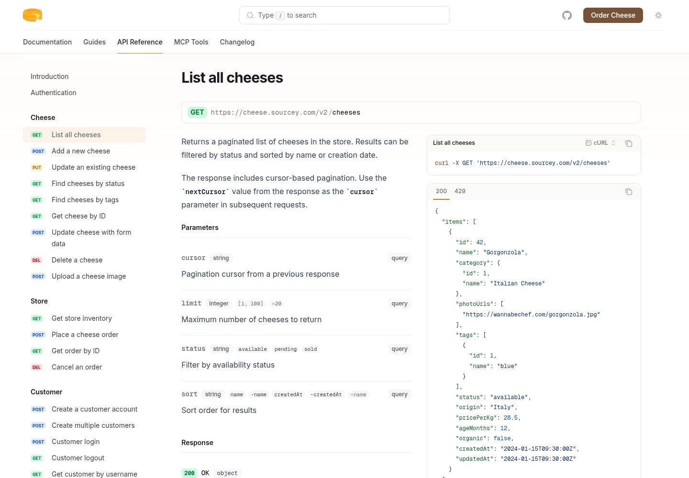

# Sourcey

> Your API docs shouldn't depend on someone else's SaaS.

Sourcey is an open source documentation platform. Point it at an OpenAPI spec, an MCP server, or a Doxygen XML directory; add markdown guides; get a complete docs site. Static HTML you own; no dashboard, no monthly bill, no API calls to render your own documentation. Deploy anywhere.

[](https://www.npmjs.com/package/sourcey)
[](https://github.com/sourcey/sourcey/actions)
[](https://nodejs.org)

```bash
npx sourcey init
```



**[Live demo](https://cheesestore.github.io/)** · [Documentation](https://sourcey.com/docs) · [GitHub](https://github.com/sourcey/sourcey)

## Features

- **API reference from OpenAPI** — endpoints, parameters, request/response schemas, auto-generated code samples in 10 languages (cURL, JavaScript, TypeScript, Python, Go, Ruby, Java, PHP, Rust, C#)
- **MCP server documentation** — tools, resources, prompts rendered as browsable reference with JSON-RPC, TypeScript, and Python code samples. Color-coded method types, annotation badges, connection config cards
- **Markdown guides with rich components** — steps, cards, accordions, syntax-highlighted code blocks; prose docs alongside your API reference
- **C++ and Doxygen** — feed Doxygen XML output, get modern searchable API docs. No new parser, no four-tool Breathe/Exhale/Sphinx pipeline
- **llms.txt generation** — auto-generate llms.txt and llms-full.txt alongside your HTML. Docs serve developers and AI agents from one build
- **TypeScript config** — `sourcey.config.ts` with `defineConfig()` autocomplete; theme, navbar, CTA buttons, footer
- **Theme presets** — default (sidebar + TOC), minimal (single column), api-first (Stripe-style three column); colors, fonts, layout dimensions, and custom CSS on top
- **Vite dev server** — SSR hot reload on every component and CSS change; spec and markdown changes trigger instant refresh
- **Dark mode** — semantic design tokens, light/dark logo variants, localStorage persistence
- **Client-side search** — instant fuzzy search across all pages and API operations; Cmd+K
- **Static HTML output** — no framework runtime, no vendor lock-in. Deploy to GitHub Pages, Vercel, Netlify, S3, anywhere
- **Open source** — AGPL-3.0. Self-host, fork, extend. Your docs, your infrastructure

### Sourcey vs alternatives

| | Sourcey | Redocly | GitBook | Mintlify | Fern | ReadMe |
|---|---|---|---|---|---|---|
| Open source | Yes | Partial | No | No | No | No |
| Static output | Yes | Yes | No | No | No | No |
| Zero JS shipped | Yes | No | No | No | No | No |
| MCP server docs | Native | No | No | No | No | No |
| Doxygen / C++ docs | Native | No | No | No | No | No |
| Config format | TypeScript | YAML | GUI | JSON | YAML | GUI |
| Local preview | Vite SSR | Local | Cloud | Local | Local | Cloud |
| No account required | Yes | Partial | No | No | No | No |
| Self-hosted | Yes | Yes | No | No | Yes | No |
| Pricing | Free | $10–$24 | $65–$249 | $250+ | $150+ | $79–$3,000+ |

## Install

```bash
# npm (recommended)
npx sourcey init

# Homebrew
brew tap sourcey/sourcey && brew install sourcey

# Docker
docker run -v $(pwd):/docs sourcey/sourcey build

# Nix
nix run github:sourcey/sourcey
```

## Quick start

```bash
# From a single OpenAPI spec
sourcey build api.yaml -o docs/

# Multi-page site (reads sourcey.config.ts)
sourcey build -o docs/

# Dev server with hot reload
sourcey dev
```

## Configuration

Create `sourcey.config.ts` in your project root:

```typescript
import { defineConfig } from "sourcey";

export default defineConfig({
  name: "My API",
  theme: {
    preset: "default",  // "default" | "minimal" | "api-first"
    colors: {
      primary: "#6366F1",
      light: "#818CF8",
      dark: "#4F46E5",
    },
  },
  logo: "./logo.png",
  navigation: {
    tabs: [
      {
        tab: "Documentation",
        groups: [
          {
            group: "Getting Started",
            pages: ["introduction", "quickstart", "authentication"],
          },
        ],
      },
      {
        tab: "API Reference",
        openapi: "./openapi.yaml",
      },
      {
        tab: "MCP Server",
        mcp: "./mcp.json",
      },
    ],
  },
  navbar: {
    links: [{ type: "github", href: "https://github.com/you/repo" }],
    primary: { type: "button", label: "Dashboard", href: "https://app.example.com" },
  },
  footer: {
    socials: { github: "https://github.com/you/repo" },
  },
});
```

Each tab is an `openapi` spec, an `mcp` snapshot, a `doxygen` directory, or `groups` of markdown pages. Pages are referenced by slug (e.g. `"quickstart"` resolves to `quickstart.md`).

### Markdown components

Guides support rich components in standard markdown:

```markdown
<Steps>
  <Step title="Install">Run `npm install sourcey`</Step>
  <Step title="Configure">Create `sourcey.config.ts`</Step>
  <Step title="Build">Run `sourcey build`</Step>
</Steps>

<CardGroup cols={2}>
  <Card title="API Reference" icon="book" href="/api">Full endpoint docs</Card>
  <Card title="Guides" icon="map" href="/docs">Step-by-step tutorials</Card>
</CardGroup>

<AccordionGroup>
  <Accordion title="How does auth work?">We use API keys and OAuth2.</Accordion>
</AccordionGroup>
```

### Theme

All visual configuration lives under `theme`. Colors, fonts, layout dimensions, and a preset that controls page structure:

```typescript
theme: {
  preset: "api-first",
  colors: { primary: "#f59e0b", light: "#fbbf24", dark: "#d97706" },
  fonts: { sans: "'Lexend', sans-serif", mono: "'Fira Code', monospace" },
  layout: { sidebar: "16rem", content: "48rem" },
  css: ["./brand.css"],
}
```

Presets control layout structure: `"default"` (sidebar + TOC), `"minimal"` (single centered column), `"api-first"` (three-column with persistent code panels). Everything else applies on top.

## CLI

```bash
sourcey dev                       Dev server (reads sourcey.config.ts)
sourcey build                     Build site (reads sourcey.config.ts)
sourcey build api.yaml            Quick build from a single spec
sourcey validate api.yaml         Validate a spec file
```

| Command | Flag | Description |
| --- | --- | --- |
| `build` | `--output, -o` | Output directory (default: `dist`) |
| `build` | `--embed, -e` | Embeddable output (no html/body wrapper) |
| `build` | `--quiet, -q` | Suppress output |
| `dev` | `--port, -p` | Dev server port (default: `4400`) |

## Development

```bash
git clone https://github.com/sourcey/sourcey.git
cd sourcey && npm install
npm run build && npm test

# Run the demo site
cd demo && npx tsx ../src/cli.ts dev
```

## License

[AGPL-3.0](LICENSE). Free to use, self-host, and modify. If you run Sourcey as a hosted service, you open-source your stack.

Commercial licensing available; contact [sourcey.com](https://sourcey.com).
